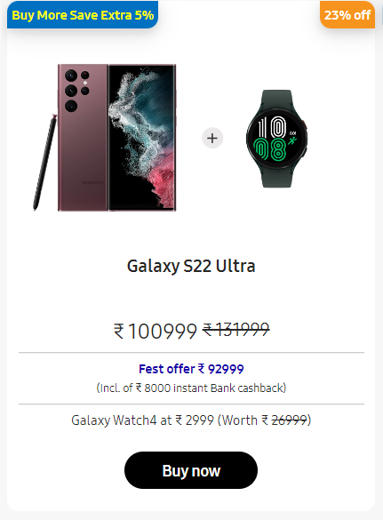
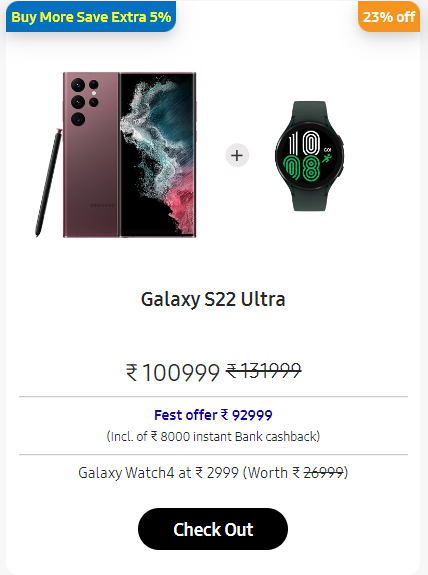

# Dom Manipulation Assignment

1. Website Name: [Dev To](https://dev.to/)

### Topics

    - Query Selector, Inner HTML

### Sample Image

### Tasks

        Target the Top description div and change the DEV Community to <Your_Name> and description to your passion

### 🟡 Code

`document.querySelector('.side-bar .crayons-card .crayons-subtitle-2').innerHTML = "iNeuron"
document.querySelector('.side-bar .crayons-card .color-base-70').innerHTML = 'I Write Code'`

### Output

2. Website Name: [Apple](https://support.apple.com/en-in)

### Task

### Fetch all the product name and store in an array

### 🟡 Code

`const arr = []
const products = document.querySelectorAll('.as-imagegrid-item');
products.forEach(item =>{
    arr.push(item.innerText.replace('\nSupport',''));
})
console.log(arr);`

### Output

['iPhone', 'Mac', 'iPad', 'Watch', 'AirPods', 'Music', 'TV']

3. Website Name: [Youtube Support](https://support.google.com/youtube/)

### Topics

    - Get Element By Id, Create Element, Create Text Node, Append Child

### Sample Image

### Tasks

     Add another FAQ 'My New FAQ' to the list

### 🟡 Code

`// create h3`

`const h3 = document.createElement("h3");`

`// put some text into h3`

`h3.innerText = "My New FAQ";`

`// create acc... section`

`const section = document.createElement("section");`

`// add class to the section`

`section.classList.add("parent");`

`// append h3 to the section`

`section.appendChild(h3);`

`// append acc.. to the acc.. homepage`

`document.querySelector('.accordion-homepage').appendChild(section);`

### Output

4. Webiste Name: [OnePlus](https://www.oneplus.in/support)

### Topics

     Query Selector, InnerText

### Sample Image

### Tasks

      Change the contact number

### 🟡 Code

`document.querySelector('.one-tel-number').innerHTML = "+91 6366256689"`

### Output

5. Webiste Name: [Samsung](https://www.samsung.com/in/offer/online/samsung-fest/)

### Topics

     getElementById, createElement, InnerText, append, setAttribute

### Sample Image

### Tasks

     Target the main div of card and change the Button text to Check out

### 🟡 Code

`document.querySelector('.diwali-deals-product-sale-pro .diwali-deals-product-sale-btn').innerText = 'Check Out'`

### Output

6. Webiste Name: [Adidas](https://www.adidas.co.in/)

### Topics

    -   Query Selector, Event listeners, Changing Styles

### Sample Image

### Tasks

     Target the search box and on hover change thebackground color to red.

### 🟡 Code

`document.querySelector('.searchinput-wrapper___3YrvF .searchinput___19uW0').style.backgroundColor = "Red"`

### Output

7. Webiste Name: [MDN Web Docs](https://developer.mozilla.org/en-US/)

### Topics

       Form, Value, Submit

### Sample Image

### Tasks

     To Search a topic in the MDN Search bar.
     First add a text to search in the search bar and then hit the submit search button to search the docs using DOM

### 🟡 Code

`document.querySelector('#top-nav-search-input').value = "CSS Selector"`
`document.querySelector('#top-nav-search-form').submit()`

### Output

8. Website Name: [Google](https://www.google.com/)

### Topics

       Remove Elements

### Sample Image

### Tasks

     Remove alternate languages from the home page languages listed

### 🟡 Code

`// Get all children of div z4hgWe`
`let allChild = document.querySelector("#SIvCob").childNodes`

`// Removing #text which is empty div`
`for(let i = 0; i < allChild.length; i+=3){`
    `allChild[i].remove()`
`}`

`// Removing few of the languages`
`for(let i = 0; i < allChild.length; i+=2){`
    `allChild[i].remove()`
`}`

### Output

9. Website Name: [Code Wars](https://www.codewars.com/)

### Topics

       Change Font Family, Color of Text.

### Sample Image

### Tasks

    Change the font family of the text to monospace and text color to the logo’s background color.

### 🟡 Code

`document.querySelector('.display-heading-1').style.fontFamily = "monospace"`
`document.querySelector('.display-heading-1').style.color = "#B1361E"`

### Output

10. Webiste Name: [Freecodecamp](https://www.freecodecamp.org/)

### Topics

       querySelector, mouseover, click eventListener,  callback function, style,

### Sample Image

### Tasks

    Target the button and change background colour on mouseover

### 🟡 Code

`const temp = document.querySelector('.login-btn-text')`
`temp.addEventListener("mouseover",bgchanger => {`
    `temp.style.backgroundColor = "Red"`
`});`

### Output

11. Website Name: [realme](https://www.realme.com/in/)

### Topics

       querySelector,style,background-image

### Sample Image

### Tasks

    change the realme logo to ineuron logo

### 🟡 Code

`document.querySelector('.wrapper .logo').innerHTML = ""`

### Output

12. Webiste Name: [Github](https://github.com/)

### Topics

       querySelector,style,background-Color

### Sample Image

### Tasks

     change the background colour of the button to blue.

### 🟡 Code

`document.querySelector('.js-braintree-encrypt button').style.backgroundColor = "Blue"`

### Output

13. Webiste Name: [Hackerrank](https://www.hackerrank.com/)

### Topics

       querySelector,innerHtml

### Sample Image

### Tasks

Target the top description and change “Matching developers with great companies” to ‘JSBOOTCAMP“.

### 🟡 Code

`document.querySelector('.fl-heading-text').innerHTML = "JSBOOTCAMP"`

### Output

14. Webiste Name: [Asus](https://www.asus.com/in/)

### Topics

      querySelector,style,font-size

### Sample Image

### Tasks

       change the fontsize of “Hot Deals” to 80px

### 🟡 Code

`document.querySelector('.HotDealsAll__Heading__2fIbe').style.fontSize = "80px";`

### Output

15. Webiste Name: [Dell](https://www.dell.com/en-in/shop/deals/laptop-deals?gacd=10415953-9016-5761040-285981356-0&dgc=ST&gclid=Cj0KCQjwguGYBhDRARIsAHgRm4-XUDMhhVNyHXb3s1gY4ZBzORr_d9Se-buhJwy7asyUe7YdqEA11eEaAt6UEALw_wcB&gclsrc=aw.ds&nclid=BxjBlpBQsX6pjSHh-L8YYSU77EpfXRkG1AGMB5Wbeu386ykspfrPDnfx_DdFau20)

### Topics

      querySelector,style.textAlign

### Sample Image

### Tasks

       Convert the text “G15 Gaming Laptop” from left to right

### 🟡 Code

`const cards = document.querySelectorAll('.ps-top .ps-title a')[4]`

`cards.style.float = "right"`

### Output

16. Webiste Name: [Vercel](https://vercel.com/)

### Topics

     querySelector,innerHTMl

### Sample Image

### Tasks

      change the heading “Start with the developer” to “Start with Scratch”

### 🟡 Code

`document.querySelector('.section-title_title__VEDfK').innerHTML = 'Start with scratch'`

### Output

17. Webiste Name: [Sony](https://www.sony.co.in/)

### Topics

    querySelector,innerHTMl

### Sample Image

### Tasks

     change the button text To current Date.

### 🟡 Code

`const date = Date();`
`document.querySelector('.btn-container .btn').innerHTML = date;`

### Output

18. Webiste Name: [Philips](https://www.philips.co.in/)

### Topics

     querySelector,style,backgroundcolor

### Sample Image

### Tasks

    change the background colour blue to orange

### 🟡 Code

`document.querySelector('.p-footer').style.backgroundColor = "Orange"`

### Output

19. Webiste Name: [Canon](https://in.canon/)

### Topics

          querySelector,src

### Sample Image

### Tasks

    extract the canon logo

### 🟡 Code

### Output

20. Webiste Name: [Oppo](https://www.oppo.com/in/)

### Topics

          querySelector,style,color

### Sample Image

### Tasks

      Change the description colour black to orange

### 🟡 Code

`document.querySelector('.desc').style.color = "Orange"`

### Output

